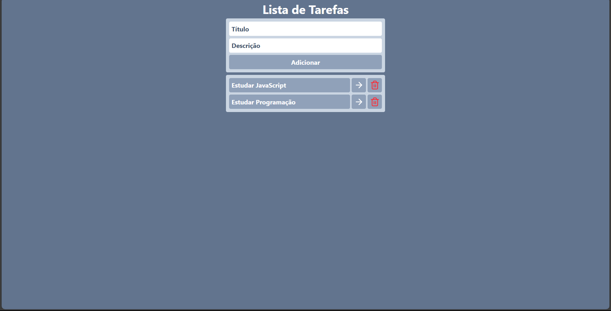

# 📋 To-Do List

Uma aplicação web simples de **Lista de Tarefas** desenvolvida como parte do meu aprendizado em **React**. A proposta do projeto é oferecer uma interface intuitiva para criar, visualizar, marcar como concluída e excluir tarefas. Além disso, busquei entender como conectar O o Front-End com o Back-End real, utilizando uma API construída por mim com **NestJS**, **Prisma ORM** e **PostgreSQL**.

> Este repositório contém apenas o **Front-End**.

## ✨ Funcionalidades:

- ✅ **Adicionar tarefas**
- 🗑️ **Remover tarefas**
- 📄 **Visualizar detalhes da tarefa**
- ☑️ **Marcar como concluída**
- 🔗 **Integração com API**

## 🛠️ Tecnologias Utilizadas:

### 🧩 Front-End:

  
  
  
  
  
  
  

### 🔙 Back-End:

  
  
  
  
  
  
  

## 🖼️ Prévia do Projeto:

  

